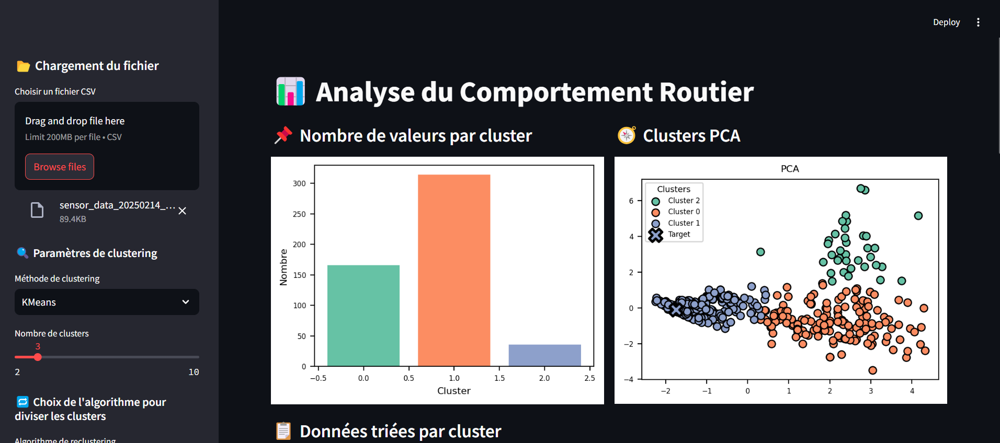
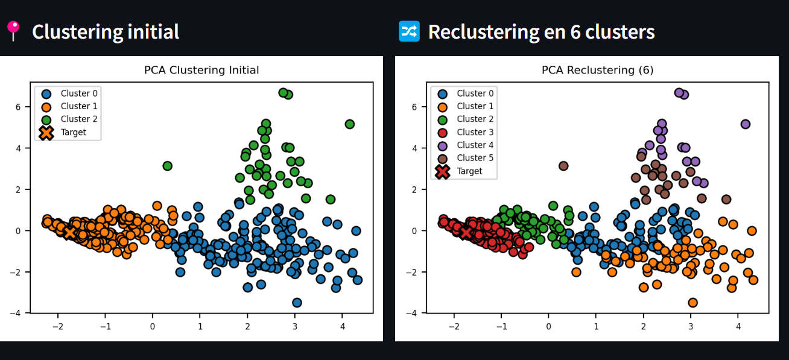
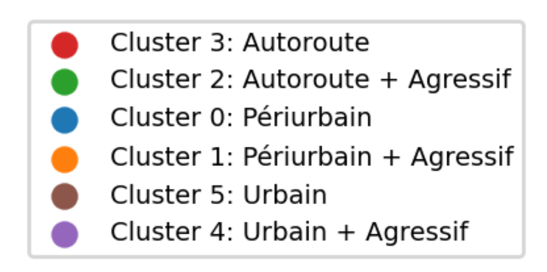
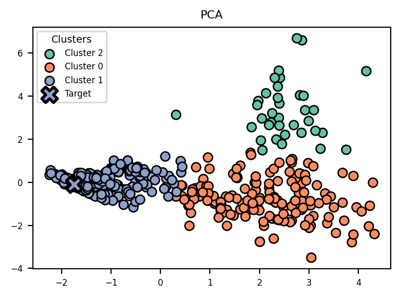
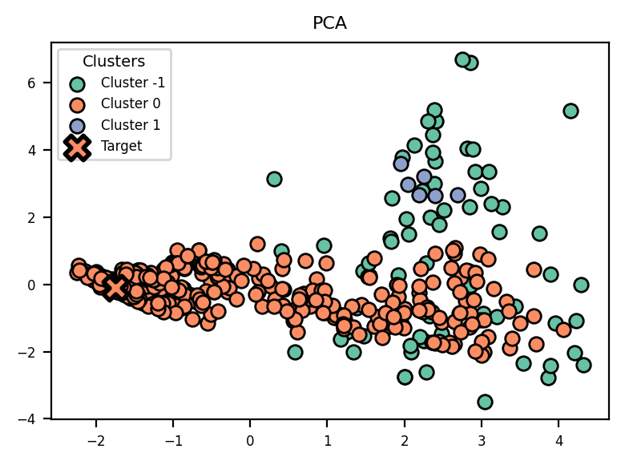
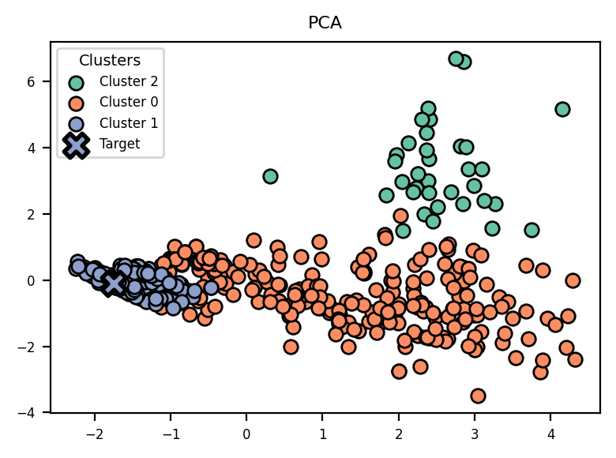
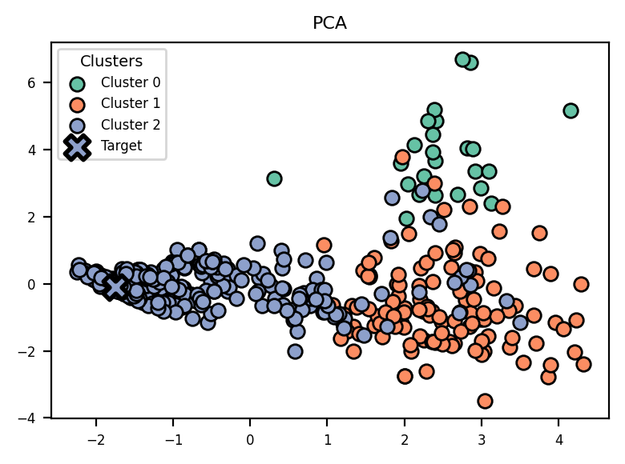

# 🚗 Analyse du Comportement Routier

> Système de collecte, traitement et classification de comportements de conduite par apprentissage non supervisé.

---

## Table des matières

- [Aperçu](#aperçu)
- [Architecture](#architecture)
- [Structure du projet](#structure-du-projet)
- [Données capteurs](#données-capteurs)
- [Fonctionnalités](#fonctionnalités)
- [Prérequis](#prérequis)
- [Installation](#installation)
- [Utilisation](#utilisation)
- [Algorithmes de clustering](#algorithmes-de-clustering)
- [Technologies](#technologies)

---

## Aperçu

Ce projet propose un pipeline complet d'analyse du comportement routier :

1. **Collecte** — Une application Android enregistre les données brutes des capteurs embarqués (accéléromètre, GPS, vitesse) durant un trajet.
2. **Prétraitement** — Les enregistrements sont segmentés en fenêtres de 3 minutes et des indicateurs statistiques sont extraits pour chaque segment.
3. **Analyse & Visualisation** — Une application Streamlit interactive applique des algorithmes de clustering sur ces indicateurs et positionne un nouveau trajet par rapport à l'historique.

L'objectif est de distinguer automatiquement différents types de conduite (urbain, autoroute, route secondaire) sans annotation préalable.

---

## Architecture

```
┌─────────────────────┐      CSV       ┌──────────────────────┐      CSV agrégé      ┌──────────────────────┐
│   Application       │ ─────────────► │  Prétraitement       │ ───────────────────► │  Dashboard           │
│   Android           │                │  (creer_fichier_3min)│                      │  Streamlit           │
│   (CollectData)     │                │  Fenêtres 3 min      │                      │  Clustering & PCA    │
└─────────────────────┘                └──────────────────────┘                      └──────────────────────┘
```

---

## Structure du projet

```
.
├── app/
│   ├── app_streamlit.py          # Application web Streamlit (analyse & clustering)
│   └── app/src/main/
│       └── java/com/example/
│           └── collectdata/      # Application Android (collecte des données)
│               └── MainActivity.kt
├── data/
│   ├── sensor_data_*.csv         # Enregistrements bruts (ville, autoroute, secondaire)
│   └── summary_by_3min.csv       # Données agrégées par fenêtre de 3 minutes
├── src/
│   ├── fonctions.py              # Extraction de features depuis un fichier CSV
│   ├── creer_fichier_3min.py     # Segmentation et agrégation des CSV bruts
│   └── IterativeNeighbors.py     # Algorithme de clustering custom (IterativeNeighbors)
├── notebooks/
│   └── analyse_données.ipynb    # Exploration et analyse exploratoire des données
├── docs/                         # Documentation complémentaire
└── results/                      # Résultats générés
```

---

## Données capteurs

Chaque fichier CSV brut contient les colonnes suivantes, échantillonnées à fréquence constante :

| Colonne           | Description                | Unité |
| ----------------- | -------------------------- | ----- |
| `Location-lat`    | Latitude GPS               | °     |
| `Location-long`   | Longitude GPS              | °     |
| `Speed`           | Vitesse instantanée        | m/s   |
| `Accelerometer-X` | Accélération longitudinale | m/s²  |
| `Accelerometer-Y` | Accélération latérale      | m/s²  |
| `Accelerometer-Z` | Accélération verticale     | m/s²  |

Les fichiers sont nommés selon la convention : `sensor_data_<AAAAMMJJ>_<type_route>_<numéro>.csv`  
Types de route : `ville`, `autoroute`, `secondaire`.

### Features extraites par segment de 3 min

| Feature                 | Description                                                  |
| ----------------------- | ------------------------------------------------------------ |
| Vitesse Moyenne (km/h)  | Moyenne de la vitesse lissée sur le segment                  |
| Vitesse Maximale (km/h) | Vitesse maximale observée                                    |
| Écart type X (m/s²)     | Variabilité de l'accélération longitudinale (freinages/acc.) |
| Écart type Y (m/s²)     | Variabilité de l'accélération latérale (virages)             |
| Stop Time (%)           | Proportion du temps passé à l'arrêt                          |
| Variation vitesse       | Moyenne des variations de vitesse sur 5 échantillons         |

> Un filtre **Savitzky-Golay** (fenêtre 15, ordre 2) est appliqué sur l'accéléromètre et la vitesse avant extraction.

---

## Fonctionnalités

- **Collecte Android** : enregistrement en temps réel de l'accéléromètre, du GPS et de la vitesse via l'application CollectData.
- **Prétraitement automatique** : segmentation des trajets en fenêtres glissantes de 3 minutes et calcul des indicateurs statistiques.
- **Clustering multi-algorithmes** : comparaison de KMeans, DBSCAN, Agglomerative Clustering et IterativeNeighbors.
- **Réduction de dimension** : visualisation des clusters en 2D via PCA.
- **Reclustering hiérarchique** : subdivision de chaque cluster en deux sous-groupes pour affiner l'analyse.
- **Positionnement d'un nouveau trajet** : un fichier CSV peut être chargé dans l'interface pour être comparé à l'historique et classifié automatiquement.

---

## Prérequis

### Dashboard Streamlit (Python)

- Python ≥ 3.9
- Packages listés ci-dessous

### Application Android

- Android Studio (Hedgehog ou supérieur recommandé)
- SDK Android ≥ 26
- Kotlin

---

## Installation

### 1. Cloner le dépôt

```bash
git clone https://github.com/bertrand-mouchel/analyse_profil_conducteur.git
cd analyse_profil_conducteur
```

### 2. Créer un environnement virtuel et installer les dépendances

```bash
python -m venv .venv
# Windows
.venv\Scripts\activate
# macOS / Linux
source .venv/bin/activate

pip install streamlit pandas numpy scipy scikit-learn matplotlib seaborn
```

---

## Utilisation

### Lancer le dashboard Streamlit

```bash
cd app
streamlit run app_streamlit.py
```

L'application s'ouvre dans votre navigateur à l'adresse `http://localhost:8501`.

**Workflow dans l'interface :**

1. **Charger un fichier CSV** — utilisez la barre latérale pour uploader un enregistrement brut issu de l'application Android.
2. **Choisir l'algorithme de clustering** — sélectionnez KMeans, DBSCAN, Agglomerative ou IterativeNeighbors et ajustez les hyperparamètres.
3. **Analyser les résultats** :
   - Histogramme du nombre de points par cluster
   - Projection PCA des clusters (le trajet chargé est mis en évidence avec un marqueur ✕)
   - Tableau récapitulatif trié par cluster
   - Reclustering automatique (subdivision de chaque cluster en 2 sous-groupes)

### Captures d'écran du dashboard

**Interface principale** — chargement d'un fichier CSV et clustering KMeans (3 clusters) :



**Clustering initial et reclustering** — projection PCA avant/après subdivision des clusters :



**Interprétation des clusters** — correspondance entre clusters et types de conduite identifiés :



---

### Compiler et installer l'application Android

```bash
cd app
./gradlew assembleDebug
```

Installer l'APK généré (`app/app/build/outputs/apk/debug/app-debug.apk`) sur un appareil Android.

---

## Algorithmes de clustering

| Algorithme             | Description                                                                     | Hyperparamètres         |
| ---------------------- | ------------------------------------------------------------------------------- | ----------------------- |
| **KMeans**             | Partitionnement centroïde classique                                             | `n_clusters`            |
| **DBSCAN**             | Clustering par densité, détecte les outliers (label `-1`)                       | `eps`, `min_samples`    |
| **Agglomerative**      | Clustering hiérarchique ascendant                                               | `n_clusters`, `linkage` |
| **IterativeNeighbors** | Algorithme custom : construction itérative de clusters par plus proches voisins | `k`, `max_clusters`     |

### IterativeNeighbors

Algorithme original développé dans ce projet. Il construit chaque cluster en partant d'un point non visité et en ajoutant itérativement le voisin le plus proche (selon la distance moyenne à tous les membres du cluster courant), jusqu'à atteindre `k` membres. Les points non assignés sont ensuite rattachés au cluster le plus proche.

### Résultats PCA par algorithme

|            KMeans             |            DBSCAN             |
| :---------------------------: | :---------------------------: |
|  |  |

|                Agglomerative                |              IterativeNeighbors              |
| :-----------------------------------------: | :------------------------------------------: |
|  |  |

---

## Technologies

| Couche           | Technologies                                      |
| ---------------- | ------------------------------------------------- |
| Collecte         | Kotlin, Android SDK, Sensors API                  |
| Prétraitement    | Python, Pandas, NumPy, SciPy (Savitzky-Golay)     |
| Machine Learning | scikit-learn (KMeans, DBSCAN, Agglomerative, PCA) |
| Visualisation    | Streamlit, Matplotlib, Seaborn                    |
| Build Android    | Gradle (Kotlin DSL)                               |

---

## Contexte académique

Projet réalisé dans le cadre du cours **INFO0806** — Master 1, Semestre 2.
